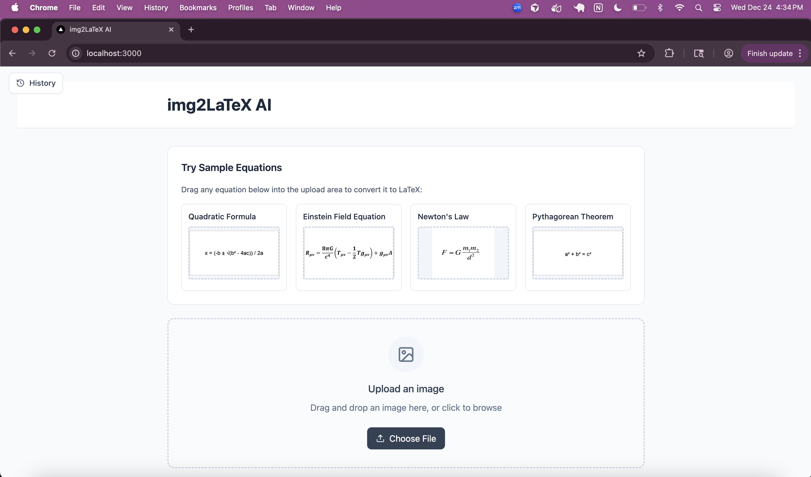
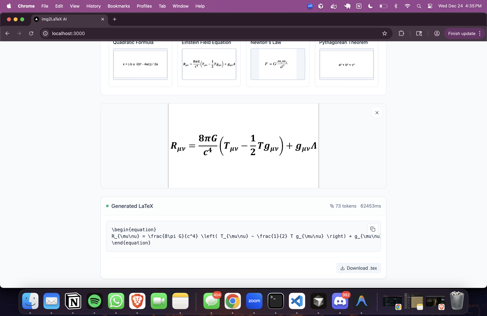
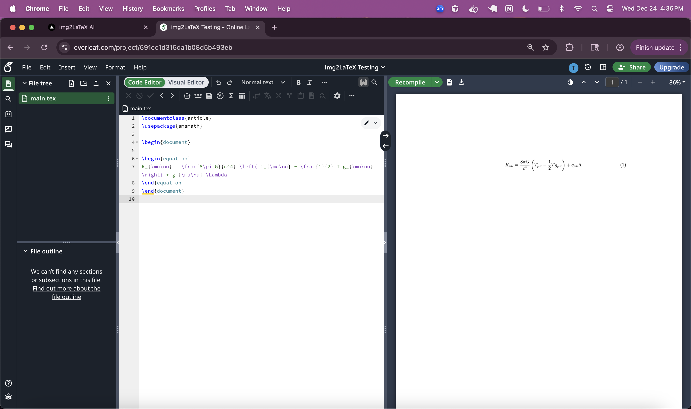

# img2LaTeX AI

Image to LaTeX conversion system using Qwen2-VL vision-language model.

## Demo

### 1. Landing Page


The home page provides an interface to upload equation images. You can either:
- Drag and drop an image file
- Click to browse and select an image
- Use one of the sample equations provided

### 2. Conversion Process


Once you upload an image, the system:
1. Processes the image through the Qwen2-VL model
2. Generates LaTeX code for the mathematical equation
3. Displays the result with token usage and processing time
4. Allows you to copy the LaTeX or download it as a `.tex` file

### 3. LaTeX Output Tested 


The history panel (button in the top-left) keeps track of all your previous conversions.

## Setup

### Backend

```bash
cd apps/api
pip install -e .
python -m uvicorn app.main:app --host 0.0.0.0 --port 8000 --reload
```

### Frontend

```bash
cd apps/web
npm install
npm run dev
```

### Development Script

```bash
# Start both backend and frontend
./start-dev.sh
```

Services:
- API: http://localhost:8000
- Web: http://localhost:3000
- API Docs: http://localhost:8000/docs

## Usage

### Web Interface

1. Start the development servers (see Setup above)
2. Open http://localhost:3000 in your browser
3. Upload an equation image or use a sample equation
4. Copy or download the generated LaTeX code

### API

Upload an image via the API:

```bash
curl -X POST "http://localhost:8000/api/infer" \
  -F "image=@path/to/equation.png"
```

Response:
```json
{
  "latex": "x = \\frac{-b \\pm \\sqrt{b^2 - 4ac}}{2a}",
  "tokens": 29,
  "time_ms": 39539,
  "id": 1
}
```

## Tech Stack

- **Backend**: FastAPI, SQLAlchemy, SQLite
- **Frontend**: React, TypeScript, Tailwind CSS, Framer Motion
- **ML Model**: Qwen2-VL (2B for CPU, 7B for GPU)
- **Inference**: PyTorch, Transformers, Unsloth (optional)
